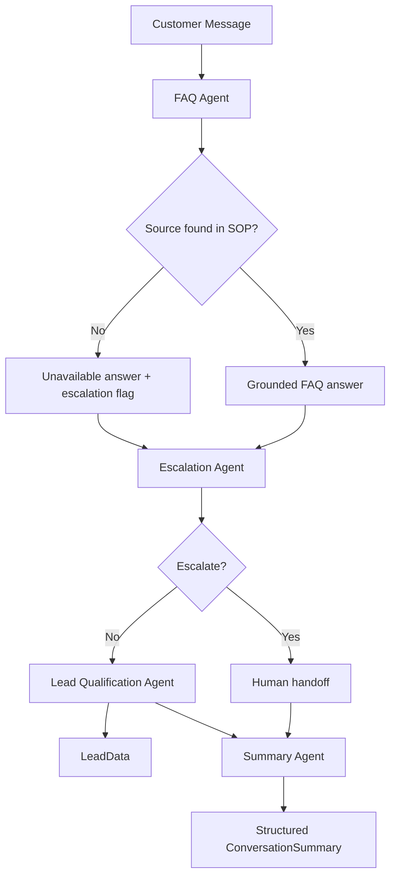

## Closira AI — Bloom Aesthetics Clinic Customer Support Workflow

Production-oriented Python 3.11+ support workflow for a fictional SMB clinic. The app simulates four coordinated agents that answer from SOP-only knowledge, qualify leads, detect escalations, and generate a final report.

## Project Overview

The business context is intentionally small and tightly bounded, which makes it a good fit for prompt engineering, structured outputs, and hallucination prevention. The system only answers from the contents of [data/sop.json](data/sop.json).

The four agents are:

1. FAQ Agent - answers SOP-backed questions and returns structured JSON.
2. Lead Qualification Agent - asks three sequential qualifying questions.
3. Escalation Agent - combines rules and model-based classification to route risky conversations.
4. Summary Agent - produces a factual end-of-session report.

## Architecture Diagram



## Installation

```bash
git clone <repo-url>
cd closira_ai_assignment
python3 -m venv .venv
source .venv/bin/activate
pip install -r requirements.txt
```

## Environment Setup

```bash
cp .env.example .env
```

Set your API key in `.env`:

```bash
OPENAI_API_KEY=your_openai_key_here
```

The app falls back to deterministic safety behavior if the key is missing, but the intended production setup uses `gpt-4.1-mini`.

## How To Run

```bash
python3 app.py
```

Type customer messages at the prompt. Use `exit`, `quit`, `bye`, or `goodbye` to end the session and generate the final summary.

## Example Outputs

### In-SOP FAQ answer

```text
Customer: What are your Botox prices?
Bloom AI: Botox treatments start from £200.
Confidence: 98%
```

### Out-of-scope escalation

```text
Customer: What Botox brand do you use?
Bloom AI: I’m sorry, I don’t have that information in the current SOP, so I can’t confirm it reliably. I’ll connect you with a member of our team who can help.
Escalation logged: SOP gap
```

### Complaint escalation

```text
Customer: I am unhappy with your service.
Bloom AI: I’m going to connect you with one of our human team members who will be better placed to help you.
Escalation logged: Complaint detected
```

### Conversation summary

```json
{
    "customer_intent": "Customer asked about pricing and booking details",
    "questions_asked": [
        "What are your Filler prices?",
        "How do I cancel an appointment?"
    ],
    "lead_information": {
        "business_type": "Individual",
        "team_size": "Just me",
        "current_tools": "None"
    },
    "sop_gaps": [],
    "escalations": [],
    "recommended_next_action": "Follow up with the customer and offer the next best step from the SOP.",
    "conversation_status": "Completed"
}
```

## Design Decisions

1. **Deterministic SOP lookup for FAQ** - The FAQ agent first maps a question to a known SOP topic. That gives a hard source boundary and makes hallucination prevention much stronger than prompt-only gating.
2. **Hybrid escalation logic** - Regex rules handle obvious triggers quickly. The LLM prompt remains available for subtle phrasing, but deterministic triggers always win.
3. **Confidence thresholding** - Low confidence is treated as a routing signal, not an output detail. If the system cannot answer confidently from SOP, it escalates.
4. **Qualification after a successful FAQ turn** - This avoids interrupting urgent complaint or escalation-driven conversations with sales questions.
5. **Structured JSON outputs** - All agents return Pydantic-backed JSON contracts, which makes downstream orchestration and logging predictable.
6. **Offline-safe fallback behavior** - If `OPENAI_API_KEY` is not configured, the app still runs on deterministic behavior instead of failing on import.

## Known Limitations

- Conversation memory is in-process only and is not persisted to a database.
- Qualification is sequential and scripted, not extracted from free-form answers.
- The SOP is intentionally tiny, so many natural follow-up questions will escalate.
- The current implementation is English-only.
- There is no retry/backoff wrapper around API calls yet.

## Project Structure

```text
closira_ai_assignment/
├── app.py
├── config/
│   └── settings.py
├── data/
│   └── sop.json
├── prompts/
│   ├── faq_system_prompt.txt
│   ├── qualification_prompt.txt
│   ├── escalation_prompt.txt
│   └── summary_prompt.txt
├── agents/
│   ├── faq_agent.py
│   ├── qualification_agent.py
│   ├── escalation_agent.py
│   └── summary_agent.py
├── models/
│   └── schemas.py
├── utils/
│   ├── logger.py
│   └── sop_loader.py
├── logs/
│   └── conversation.log
├── test_transcripts/
│   ├── in_scope.md
│   ├── out_of_scope.md
│   ├── complaint.md
│   ├── qualification.md
│   └── summary.md
├── README.md
├── prompt_design.md
├── requirements.txt
└── .env.example
```

```python
EscalationResult(
    escalate = bool,
    reason   = str   # e.g. "Complaint detected", "Medical question detected"
)
```

---

### Agent 4 — Summary Agent (`agents/summary_agent.py`)

Produces a structured session report by passing the full conversation history, lead data, escalation reasons, and SOP gaps to the model in a single prompt. Temperature is set to `0.1` for maximum factual fidelity.

```python
ConversationSummary(
    customer_intent          = str,
    questions_asked          = list[str],
    lead_information         = LeadData,
    sop_gaps                 = list[str],
    escalations              = list[str],
    recommended_next_action  = str,
    conversation_status      = Literal["Completed", "Escalated", "Incomplete"]
)
```

---

## Hallucination Prevention

Five independent defensive layers — each capable of catching what the previous layer misses:

```
┌─────────────────────────────────────────────────────────────────────┐
│  LAYER 1 — Prompt Restriction                                       │
│  "Your ONLY knowledge source is the SOP data provided below."      │
│  "You must NEVER invent, guess, or infer facts not in the SOP."    │
│  Capitalised ONLY + triple-negative (invent/guess/infer) closes     │
│  the semantic space through which compliant non-compliance occurs.  │
├─────────────────────────────────────────────────────────────────────┤
│  LAYER 2 — Source Validation (source_found field)                   │
│  Model self-reports whether its answer derives from SOP.            │
│  source_found=false → immediate escalation, no retry.              │
├─────────────────────────────────────────────────────────────────────┤
│  LAYER 3 — Confidence Score with Calibration Rubric                 │
│  Model reports confidence on a rubric anchored to observable        │
│  evidence. Confidence < 0.5 → escalation regardless of answer.     │
├─────────────────────────────────────────────────────────────────────┤
│  LAYER 4 — Escalation Fallback (no second attempt)                  │
│  On any failure signal, the system escalates — it never retries     │
│  with a different prompt or attempts to synthesise an answer.       │
├─────────────────────────────────────────────────────────────────────┤
│  LAYER 5 — unanswered_count Threshold                               │
│  Tracks consecutive out-of-scope answers in app.py.                │
│  Counter resets to 0 on every successful SOP answer.               │
│  unanswered_count > 2 → forced escalation.                         │
└─────────────────────────────────────────────────────────────────────┘
```

---

## Escalation Logic

All escalation triggers, detection methods, and sources:

| Trigger | Detection | Source |
|---|---|---|
| Complaint / dissatisfaction | Rule-based + LLM | `COMPLAINT_PATTERNS` regex + semantic |
| Negative sentiment (indirect) | LLM only | Semantic classification |
| Human / manager request | Rule-based + LLM | `HUMAN_REQUEST_PATTERNS` regex |
| Medical question | Rule-based + LLM | `MEDICAL_PATTERNS` regex |
| Pricing negotiation | Rule-based + LLM | `PRICING_NEG_PATTERNS` regex |
| Low confidence | Threshold check | `confidence < 0.5` from FAQResponse |
| Repeated unknown questions | Counter check | `unanswered_count > 2` in app.py |
| FAQ agent self-flag | Propagated | `requires_escalation=true` in FAQResponse |

Every escalation is logged as a structured JSON event in `logs/conversation.log` with timestamp, reason, and triggering message.

---

## Project Structure

```
closira_ai_assignment/
│
├── app.py                        # CLI entrypoint · conversation orchestrator
│                                 # Manages state: history, lead_data,
│                                 # escalations, sop_gaps, unanswered_count
│
├── config/
│   └── settings.py               # Env vars · path constants · thresholds
│
├── data/
│   └── sop.json                  # Business SOP (single source of truth)
│
├── prompts/
│   ├── faq_system_prompt.txt     # SOP-grounded FAQ system prompt
│   ├── qualification_prompt.txt  # Lead collection conversational prompt
│   ├── escalation_prompt.txt     # Semantic escalation classifier prompt
│   └── summary_prompt.txt        # End-of-session report generator prompt
│
├── agents/
│   ├── faq_agent.py              # Stage 1: SOP-grounded Q&A
│   ├── qualification_agent.py    # Stage 2: Lead data collection
│   ├── escalation_agent.py       # Stage 3: Hybrid escalation detection
│   └── summary_agent.py          # Stage 4: Structured session report
│
├── models/
│   └── schemas.py                # Pydantic v2 models for all agent I/O
│
├── utils/
│   ├── logger.py                 # Structured JSON logging (per-turn + events)
│   └── sop_loader.py             # SOP JSON → formatted text for prompt injection
│
├── logs/
│   └── conversation.log          # Auto-generated · JSON-lines format
│
├── test_transcripts/
│   ├── in_scope.md               # Scenario: in-SOP question
│   ├── out_of_scope.md           # Scenario: SOP gap + escalation
│   ├── complaint.md              # Scenario: complaint detection
│   ├── qualification.md          # Scenario: lead qualification flow
│   └── summary.md                # Scenario: full session + summary output
│
├── README.md
├── prompt_design.md              # Full prompt documentation + reasoning
├── requirements.txt
└── .env.example
```

---

## Data Models

All agent inputs and outputs are typed via **Pydantic v2** schemas (`models/schemas.py`):

```python
class FAQResponse(BaseModel):
    answer: str
    confidence: float            # 0.0–1.0
    source_found: bool
    requires_escalation: bool

class LeadData(BaseModel):
    business_type: Optional[str]
    team_size: Optional[str]
    current_tools: Optional[str]

class EscalationResult(BaseModel):
    escalate: bool
    reason: str

class ConversationSummary(BaseModel):
    customer_intent: str
    questions_asked: list[str]
    lead_information: LeadData
    sop_gaps: list[str]
    escalations: list[str]
    recommended_next_action: str
    conversation_status: str     # "Completed" | "Escalated" | "Incomplete"

class ConversationTurn(BaseModel):
    role: str                    # "user" | "assistant"
    content: str
```

---

## Installation

**Requirements:** Python 3.11+, pip

```bash
# 1. Clone the repository
git clone https://github.com/Sudharsanselvaraj/SOP-Grounded-Conversational-Intelligence-And-Workflow-Orchestration-Framework.git
cd SOP-Grounded-Conversational-Intelligence-And-Workflow-Orchestration-Framework

# 2. Create and activate a virtual environment
python -m venv venv
source venv/bin/activate          # macOS/Linux
# venv\Scripts\activate           # Windows

# 3. Install dependencies
pip install -r requirements.txt
```

**Dependencies:**

```
openai>=1.30.0        # OpenAI Python SDK
pydantic>=2.7.0       # Data validation and structured outputs
python-dotenv>=1.0.0  # Environment variable management
rich>=13.7.0          # Terminal UI formatting
```

---

## Configuration
>>>>>>> origin/main

```bash
cp .env.example .env
```

<<<<<<< HEAD
Set your API key in `.env`:

```bash
OPENAI_API_KEY=your_openai_key_here
```

The app falls back to deterministic safety behavior if the key is missing, but the intended production setup uses `gpt-4.1-mini`.

## How To Run

```bash
python3 app.py
```

Type customer messages at the prompt. Use `exit`, `quit`, `bye`, or `goodbye` to end the session and generate the final summary.

## Example Outputs

### In-SOP FAQ answer

```text
Customer: What are your Botox prices?
Bloom AI: Botox treatments start from £200.
Confidence: 98%
```

### Out-of-scope escalation

```text
Customer: What Botox brand do you use?
Bloom AI: I’m sorry, I don’t have that information in the current SOP, so I can’t confirm it reliably. I’ll connect you with a member of our team who can help.
Escalation logged: SOP gap
```

### Complaint escalation

```text
Customer: I am unhappy with your service.
Bloom AI: I’m going to connect you with one of our human team members who will be better placed to help you.
Escalation logged: Complaint detected
```

### Conversation summary

```json
{
     "customer_intent": "Customer asked about pricing and booking details",
     "questions_asked": [
          "What are your Filler prices?",
          "How do I cancel an appointment?"
     ],
     "lead_information": {
          "business_type": "Individual",
          "team_size": "Just me",
          "current_tools": "None"
     },
     "sop_gaps": [],
     "escalations": [],
     "recommended_next_action": "Follow up with the customer and offer the next best step from the SOP.",
     "conversation_status": "Completed"
}
```

## Design Decisions

1. **Deterministic SOP lookup for FAQ** - The FAQ agent first maps a question to a known SOP topic. That gives a hard source boundary and makes hallucination prevention much stronger than prompt-only gating.
2. **Hybrid escalation logic** - Regex rules handle obvious triggers quickly. The LLM prompt remains available for subtle phrasing, but deterministic triggers always win.
3. **Confidence thresholding** - Low confidence is treated as a routing signal, not an output detail. If the system cannot answer confidently from SOP, it escalates.
4. **Qualification after a successful FAQ turn** - This avoids interrupting urgent complaint or escalation-driven conversations with sales questions.
5. **Structured JSON outputs** - All agents return Pydantic-backed JSON contracts, which makes downstream orchestration and logging predictable.
6. **Offline-safe fallback behavior** - If `OPENAI_API_KEY` is not configured, the app still runs on deterministic behavior instead of failing on import.

## Known Limitations

- Conversation memory is in-process only and is not persisted to a database.
- Qualification is sequential and scripted, not extracted from free-form answers.
- The SOP is intentionally tiny, so many natural follow-up questions will escalate.
- The current implementation is English-only.
- There is no retry/backoff wrapper around API calls yet.

## Project Structure

```text
closira_ai_assignment/
├── app.py
├── config/
│   └── settings.py
├── data/
│   └── sop.json
├── prompts/
│   ├── faq_system_prompt.txt
│   ├── qualification_prompt.txt
│   ├── escalation_prompt.txt
│   └── summary_prompt.txt
├── agents/
│   ├── faq_agent.py
│   ├── qualification_agent.py
│   ├── escalation_agent.py
│   └── summary_agent.py
├── models/
│   └── schemas.py
├── utils/
│   ├── logger.py
│   └── sop_loader.py
├── logs/
│   └── conversation.log
├── test_transcripts/
│   ├── in_scope.md
│   ├── out_of_scope.md
│   ├── complaint.md
│   ├── qualification.md
│   └── summary.md
├── README.md
├── prompt_design.md
├── requirements.txt
└── .env.example
```
=======
Edit `.env`:

```env
OPENAI_API_KEY=sk-your-key-here   # Required
MODEL=gpt-4.1-mini                # Default model
MAX_TOKENS=1024                   # Max tokens per response
TEMPERATURE=0.2                   # Low temperature for factual consistency
```

**Configuration constants** (`config/settings.py`):

```python
UNANSWERED_ESCALATION_THRESHOLD = 2    # Consecutive gaps before escalation
LOW_CONFIDENCE_THRESHOLD        = 0.5  # Minimum confidence to avoid escalation
```

---

## Running the System

```bash
python app.py
```

The CLI launches an interactive session. Type your message at the `You:` prompt. End the session by typing `exit`, `quit`, or `bye` — the summary report generates automatically.

---

## CLI Walkthrough

```
╔══════════════════════════════════════════╗
║   Bloom Aesthetics Clinic · AI Support   ║
╚══════════════════════════════════════════╝
Powered by Closira

🌸 Bloom AI: Welcome to Bloom Aesthetics Clinic! I'm here to help with any
             questions about our services, pricing, or bookings.

You: What are your Botox prices?

🌸 Bloom AI: Botox treatments at Bloom Aesthetics Clinic start from £200.
             We also offer a free consultation if you'd like to discuss
             your goals before committing to any treatment.

[Confidence: 95%]

🌸 Bloom AI: Before I let you go, may I ask a couple of quick questions?

🌸 Bloom AI: Could I ask — what type of business are you with?
You: Small aesthetics clinic

🌸 Bloom AI: Great! And roughly how many people are on your team?
You: 15

🌸 Bloom AI: What tools or software does your team currently use?
You: HubSpot and Fresha

🌸 Bloom AI: Perfect, thank you! Is there anything else I can help you with?

You: exit

────────────── Generating Conversation Summary ──────────────

╭─────────────── Session Summary ────────────────╮
│ {                                               │
│   "customer_intent": "Enquiring about Botox    │
│     pricing before booking",                   │
│   "questions_asked": [                         │
│     "What are your Botox prices?"              │
│   ],                                           │
│   "lead_information": {                        │
│     "business_type": "Small aesthetics clinic",│
│     "team_size": "15",                         │
│     "current_tools": "HubSpot and Fresha"      │
│   },                                           │
│   "sop_gaps": [],                              │
│   "escalations": [],                           │
│   "recommended_next_action": "Follow up to    │
│     convert consultation interest to booking", │
│   "conversation_status": "Completed"           │
│ }                                               │
╰─────────────────────────────────────────────────╯
```

---

## Test Scenarios

All transcripts available in `test_transcripts/`.

| # | Scenario | Input Signal | Expected Behaviour |
|---|---|---|---|
| 1 | In-SOP question | `"What are your Botox prices?"` | SOP answer, confidence ≥ 0.9, no escalation |
| 2 | Out-of-scope question | `"What Botox brand do you use?"` | source_found=false, escalation triggered |
| 3 | Complaint | `"I am unhappy with your service"` | Rule-based detection, immediate escalation |
| 4 | Human request | `"I want to speak to a manager"` | Pattern match, escalation with reason |
| 5 | Medical question | `"Can pregnant women receive Botox?"` | MEDICAL_PATTERNS match, escalation |
| 6 | Lead qualification | Full in-SOP conversation | LeadData captured across 3 questions |
| 7 | Conversation summary | Session end | ConversationSummary JSON generated |

---

## Logging System

Every conversation turn and system event is written to `logs/conversation.log` as a **JSON-lines** format (one JSON object per line), making it trivially parseable for analysis or replay.

**Per-turn log entry:**
```json
{
  "timestamp": "2025-05-23T08:30:12.441Z",
  "user_message": "What are your Botox prices?",
  "ai_response": "Botox treatments start from £200...",
  "confidence": 0.95,
  "escalation_reason": null
}
```

**Event log entry (escalation):**
```json
{
  "timestamp": "2025-05-23T08:31:05.112Z",
  "event": "escalation_triggered",
  "escalate": true,
  "reason": "Complaint detected",
  "message": "I am really unhappy with your service"
}
```

**Event log entry (summary):**
```json
{
  "timestamp": "2025-05-23T08:35:22.773Z",
  "event": "summary_generated",
  "customer_intent": "...",
  "conversation_status": "Completed"
}
```

---

## Design Decisions

### 1. SOP injection over fine-tuning
The SOP is injected at runtime between explicit delimiters rather than baked into a fine-tuned model. This means any team member can update `data/sop.json` and the change takes effect immediately — no retraining, no deployment pipeline.

### 2. Hybrid escalation (rules + LLM)
Rule-based regex catches high-signal keywords in sub-millisecond time at zero API cost. LLM classification runs only when rules pass, handling indirect sentiment and paraphrased requests. Neither approach alone is sufficient: rules miss nuance, LLMs miss reliability.

### 3. Self-reported confidence scoring
Confidence is elicited from the FAQ agent via a rubric embedded in the system prompt, rather than computed post-hoc by a separate classifier. This is more efficient (one API call vs two) and forces the model to reason about its own knowledge boundaries during generation — the point at which grounding decisions are actually made.

### 4. Qualification timing
The qualification flow is gated: it fires only after the first successful SOP answer. This ensures the agent never interrupts a complaint escalation or medical question with lead capture questions — which would be tone-deaf in a real interaction.

### 5. `response_format={"type": "json_object"}`
Used for all structured-output agents (FAQ, escalation, summary). This enforces valid JSON at the API layer, eliminating brittle markdown fence stripping and partial-response parsing.

### 6. Pydantic v2 at every boundary
Every agent returns a typed Pydantic model, not a raw dict. This means schema violations surface at validation time with clear error messages rather than silently propagating bad data through the pipeline.

---

## Known Limitations & Future Work

| Limitation | Production Solution |
|---|---|
| No persistent session storage | PostgreSQL + session_id keying for multi-user deployments |
| Single-turn FAQ (no context window) | Rolling message history passed to FAQ agent |
| Sequential qualification flow | NLU extraction from free-form conversation |
| No retry / backoff on API errors | `tenacity` with exponential backoff |
| English-only | Language detection → translated prompts |
| No async support | `asyncio` + `aiohttp` for concurrent sessions |
| Rule-based patterns English-only | Multilingual keyword lists per locale |
| Escalation routing is uniform | Route by reason: complaints → CX team, medical → nurse |

---

## Prompt Engineering Reference

See [`prompt_design.md`](./prompt_design.md) for:
- Full system prompts for all four agents
- Reasoning behind every prompt design choice
- Hallucination prevention strategy in depth
- Confidence calibration methodology
- Escalation design rationale
- Tone and persona documentation
- Future improvement roadmap

---

<div align="center">

**Built by [Sudharsanselvaraj](https://github.com/Sudharsanselvaraj) · Closira AI Engineering Assignment · May 2025**

</div>
>>>>>>> origin/main
