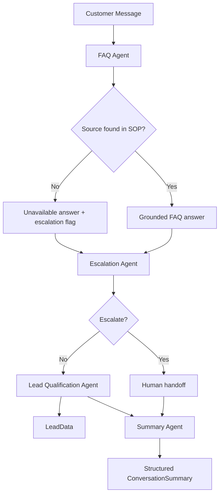

# Closira AI — Bloom Aesthetics Clinic Customer Support Workflow

Production-oriented Python 3.11+ support workflow for a fictional SMB clinic. The app simulates four coordinated agents that answer from SOP-only knowledge, qualify leads, detect escalations, and generate a final report.

## Project Overview

The business context is intentionally small and tightly bounded, which makes it a good fit for prompt engineering, structured outputs, and hallucination prevention. The system only answers from the contents of [data/sop.json](data/sop.json).

The four agents are:

1. FAQ Agent - answers SOP-backed questions and returns structured JSON.
2. Lead Qualification Agent - asks three sequential qualifying questions.
3. Escalation Agent - combines rules and model-based classification to route risky conversations.
4. Summary Agent - produces a factual end-of-session report.

## Architecture Diagram



## Installation

```bash
git clone <repo-url>
cd closira_ai_assignment
python3 -m venv .venv
source .venv/bin/activate
pip install -r requirements.txt
```

## Environment Setup

```bash
cp .env.example .env
```

Set your API key in `.env`:

```bash
OPENAI_API_KEY=your_openai_key_here
```

The app falls back to deterministic safety behavior if the key is missing, but the intended production setup uses `gpt-4.1-mini`.

## How To Run

```bash
python3 app.py
```

Type customer messages at the prompt. Use `exit`, `quit`, `bye`, or `goodbye` to end the session and generate the final summary.

## Example Outputs

### In-SOP FAQ answer

```text
Customer: What are your Botox prices?
Bloom AI: Botox treatments start from £200.
Confidence: 98%
```

### Out-of-scope escalation

```text
Customer: What Botox brand do you use?
Bloom AI: I’m sorry, I don’t have that information in the current SOP, so I can’t confirm it reliably. I’ll connect you with a member of our team who can help.
Escalation logged: SOP gap
```

### Complaint escalation

```text
Customer: I am unhappy with your service.
Bloom AI: I’m going to connect you with one of our human team members who will be better placed to help you.
Escalation logged: Complaint detected
```

### Conversation summary

```json
{
     "customer_intent": "Customer asked about pricing and booking details",
     "questions_asked": [
          "What are your Filler prices?",
          "How do I cancel an appointment?"
     ],
     "lead_information": {
          "business_type": "Individual",
          "team_size": "Just me",
          "current_tools": "None"
     },
     "sop_gaps": [],
     "escalations": [],
     "recommended_next_action": "Follow up with the customer and offer the next best step from the SOP.",
     "conversation_status": "Completed"
}
```

## Design Decisions

1. **Deterministic SOP lookup for FAQ** - The FAQ agent first maps a question to a known SOP topic. That gives a hard source boundary and makes hallucination prevention much stronger than prompt-only gating.
2. **Hybrid escalation logic** - Regex rules handle obvious triggers quickly. The LLM prompt remains available for subtle phrasing, but deterministic triggers always win.
3. **Confidence thresholding** - Low confidence is treated as a routing signal, not an output detail. If the system cannot answer confidently from SOP, it escalates.
4. **Qualification after a successful FAQ turn** - This avoids interrupting urgent complaint or escalation-driven conversations with sales questions.
5. **Structured JSON outputs** - All agents return Pydantic-backed JSON contracts, which makes downstream orchestration and logging predictable.
6. **Offline-safe fallback behavior** - If `OPENAI_API_KEY` is not configured, the app still runs on deterministic behavior instead of failing on import.

## Known Limitations

- Conversation memory is in-process only and is not persisted to a database.
- Qualification is sequential and scripted, not extracted from free-form answers.
- The SOP is intentionally tiny, so many natural follow-up questions will escalate.
- The current implementation is English-only.
- There is no retry/backoff wrapper around API calls yet.

## Project Structure

```text
closira_ai_assignment/
├── app.py
├── config/
│   └── settings.py
├── data/
│   └── sop.json
├── prompts/
│   ├── faq_system_prompt.txt
│   ├── qualification_prompt.txt
│   ├── escalation_prompt.txt
│   └── summary_prompt.txt
├── agents/
│   ├── faq_agent.py
│   ├── qualification_agent.py
│   ├── escalation_agent.py
│   └── summary_agent.py
├── models/
│   └── schemas.py
├── utils/
│   ├── logger.py
│   └── sop_loader.py
├── logs/
│   └── conversation.log
├── test_transcripts/
│   ├── in_scope.md
│   ├── out_of_scope.md
│   ├── complaint.md
│   ├── qualification.md
│   └── summary.md
├── README.md
├── prompt_design.md
├── requirements.txt
└── .env.example
```
